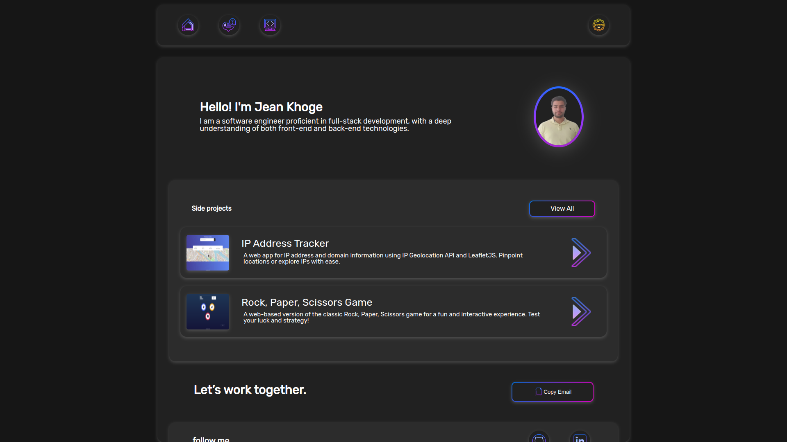

# Portfolio

Portfolio is a web application that showcases my skills as a junior fullstack developer. It includes the following key features:



## Table of Contents

- [Features](#features)
- [Getting Started](#getting-started)
  - [Prerequisites](#prerequisites)
  - [Installation](#installation)
- [Usage](#usage)
- [Demo](#demo)
- [Technologies](#technologies)

## Features

- **Dark Theme:** Portfolio offers a sleek and eye-friendly dark theme for users who prefer a different visual style.

- **Responsive Design:** The project is designed to ensure optimal user experience on various devices, from desktops to smartphones.

- **Beautiful CSS:** The project showcases my proficiency in CSS, featuring stunning and well-organized styles that enhance its aesthetics.

## Getting Started

### Prerequisites

To run this project, you need to have the following software/tools installed on your machine:

- [Node.js](https://nodejs.org/) (with npm)

### Installation

1. Clone the repository:

   ```bash
   git clone https://github.com/jeankh/portfolio
   ```

2. Navigate to the project directory:

   ```bash
   cd your-project

   ```

3. Install project dependencies:
   ```bash
   npm install
   ```

### Usage

1. Start the development server:
   ```bash
   npm start
   ```
2. Open your web browser and go to http://localhost:3000 to access the Portfolio app.

### Demo

You can check out the live demo of the Portfolio [here](https://jean.khoge.fr).

### Technologies

- ReactJS
- HTML/CSS
